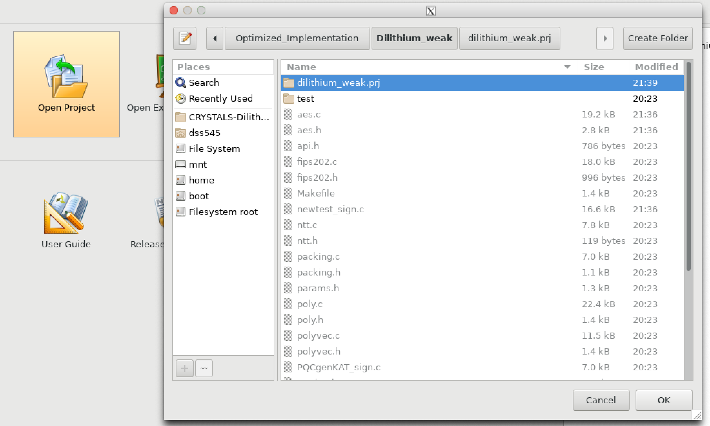
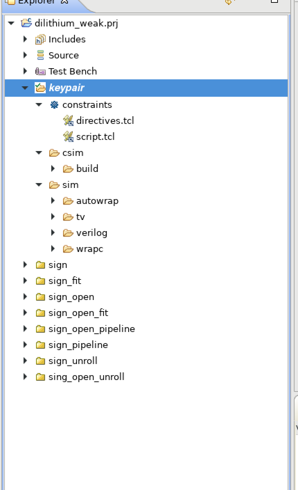
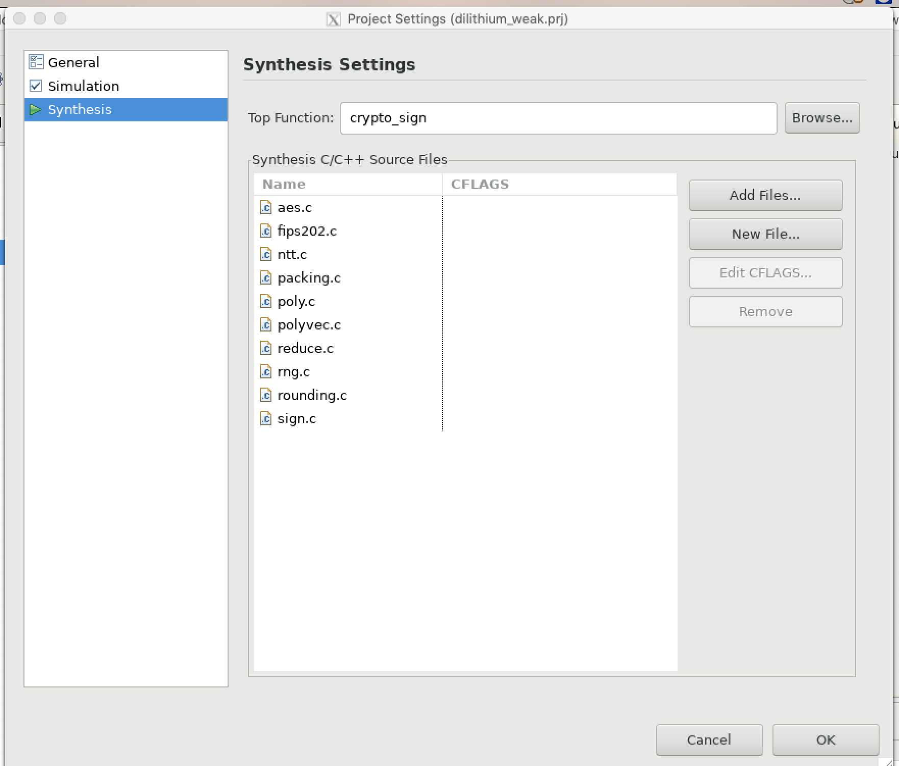
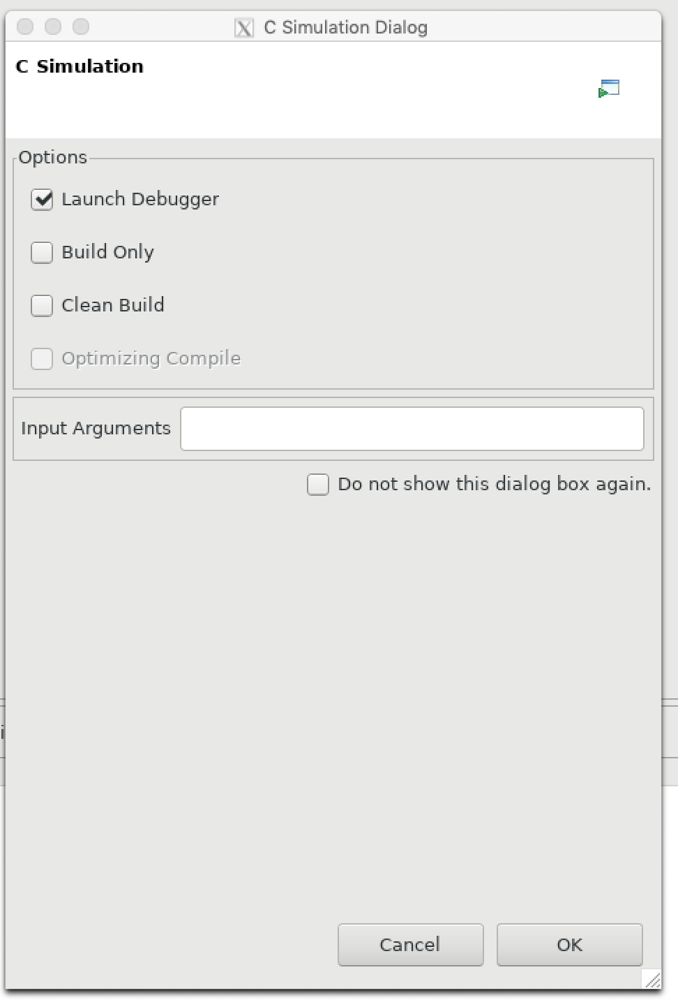
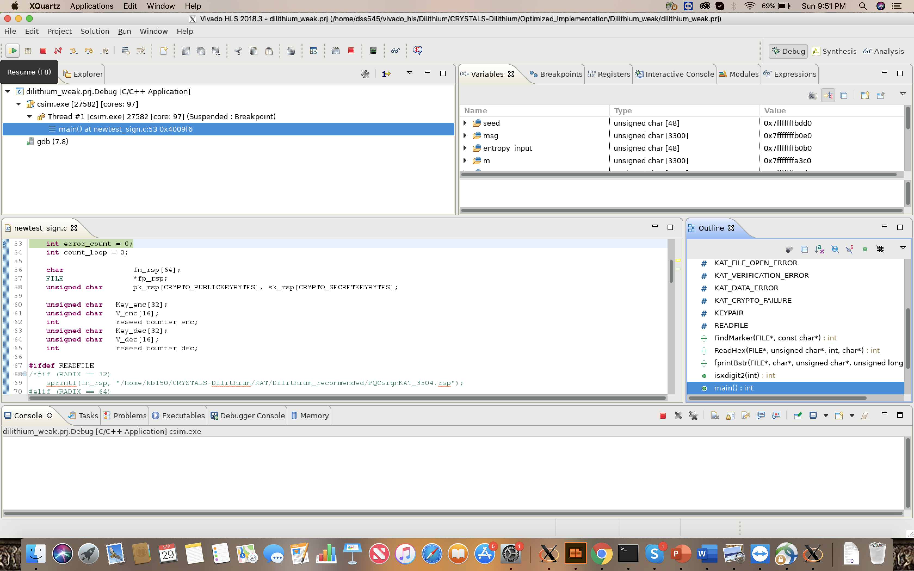
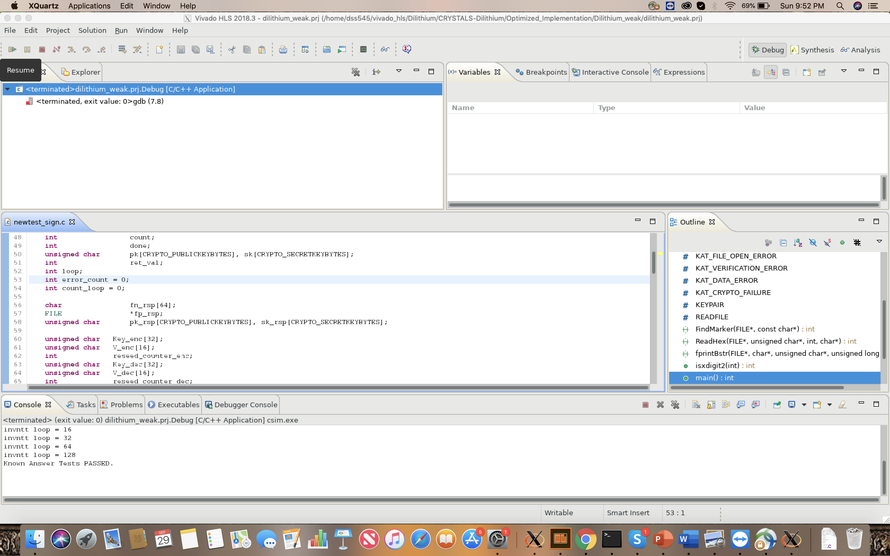
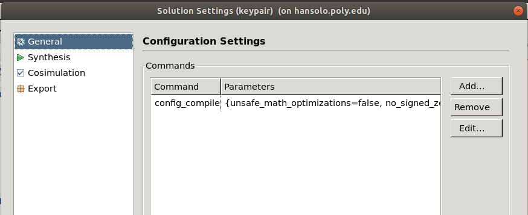
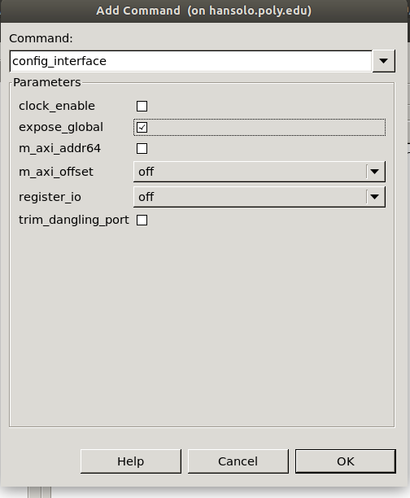

# PQC Hardware Implementation

### Publication

If you use this [software](https://csrc.nist.gov/CSRC/media/Events/Second-PQC-Standardization-Conference/documents/accepted-papers/soni-hardware-evaluation.pdf) or [methodology](https://eprint.iacr.org/2019/047.pdf) in your research, kindly cite our work.
```
@misc{pqc2019,
    author = {Kanad Basu and Deepraj Soni and Mohammed Nabeel and Ramesh Karri},
    title = {{NIST} Post-Quantum Cryptography- A Hardware Evaluation Study},
    howpublished = {IACR Cryptology ePrint Archive, Report 2019/047},
    year = {2019},
    note = {\url{https://eprint.iacr.org/2019/047}},
}

@inproceedings{soni2019,
  title={A Hardware Evaluation Study of {NIST}
Post-Quantum Cryptographic Signature schemes},
    author = {Deepraj Soni and Kanad Basu and Mohammed Nabeel and Ramesh Karri},
  booktitle={Second PQC Standardization Conference},
  year={2019},
  organization={NIST},
  note = {\url{https://csrc.nist.gov/CSRC/media/Events/Second-PQC-Standardization-Conference/documents/accepted-papers/soni-hardware-evaluation.pdf}},
}

```

### Open Project
* Download the github project in the local repository.
* Open the project. The project name ends with (.prj). 
 
* The project has different solutions. Each solution has unique target device, clock period, cosimultation settings, and configuration settings.
 
* For all the solutions, the top module is same. Change or view the top module from, project -> project settings -> synthesis.
 


### C-Simulation 
* The C-simulation is common for all the solution. Run the C-simulation: Project -> Run C Simulation.
 
* We run the C-simulation with debug mode. Simulation does not work on normal mode. Hence, make sure "Launch Debugger" is ticked.
* In the debug mode, run the "Resume(F8)" to start the simulation. If the program works successfully, console shows "Known Answer test PASSED."
 
 

### Synthesis
* Expose the global variables for synthesis.
* solution settings -> General -> Add/Edit -> config_interface -> expose_global
 
 
